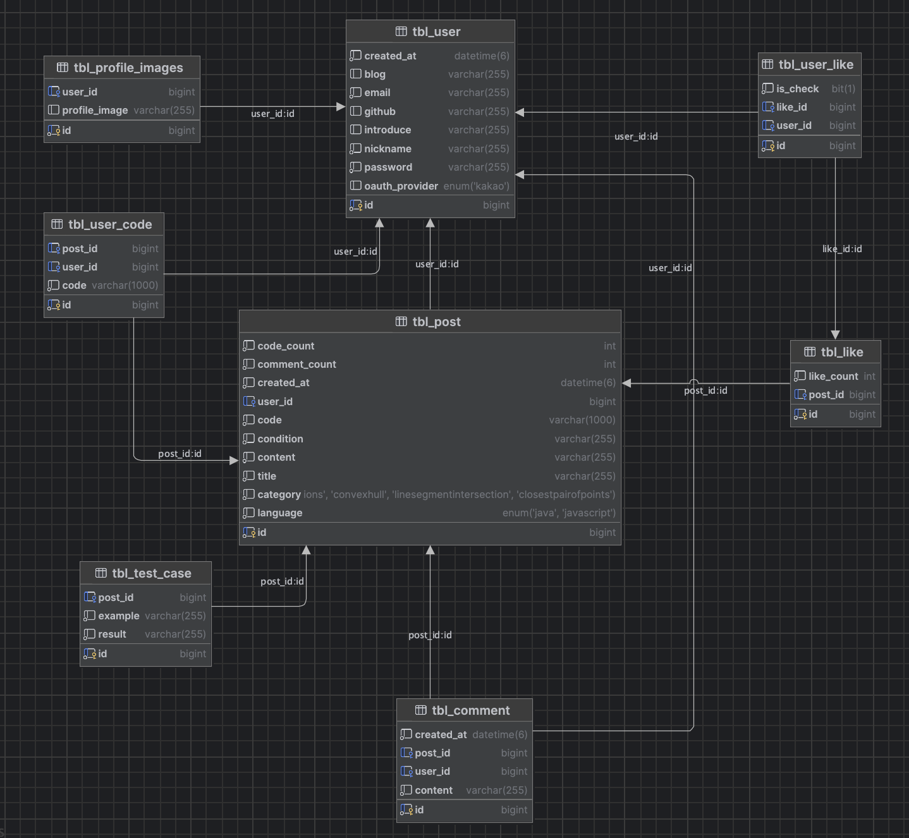
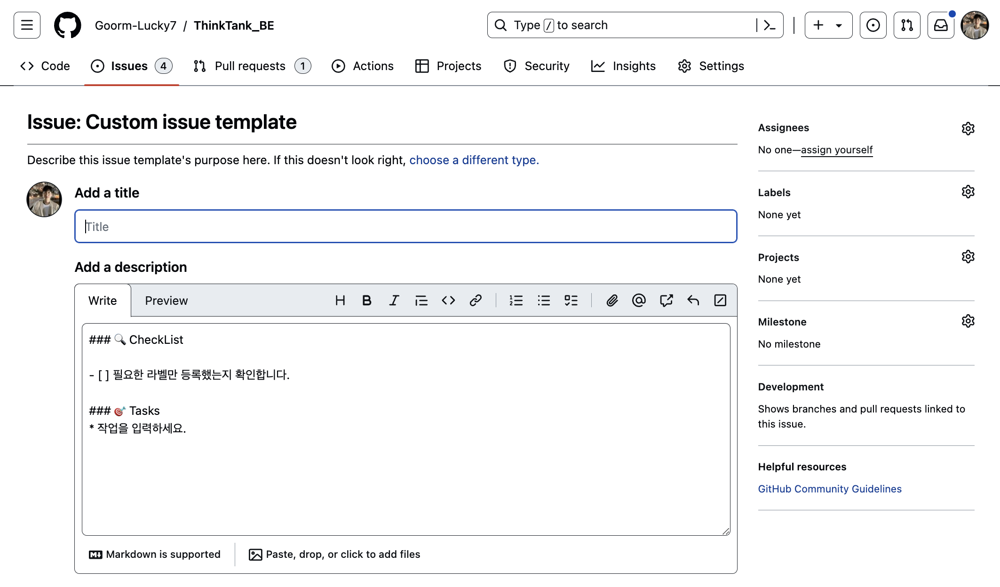
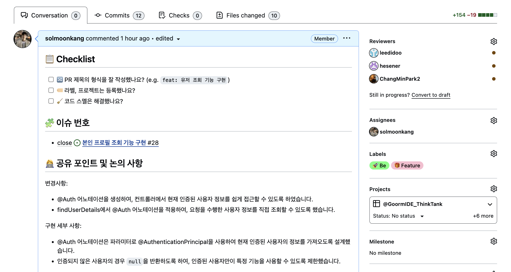

# 💛 WebIDE 프로젝트 feat.ThinkTank
<a href="https://d26i62iijbw0u2.cloudfront.net/"></a>
<br/>

**프로젝트 기간** : 2024.04.25 ~ 2023.05.20

🔗 [ThinkTank 서비스 둘러보기](http://d26i62iijbw0u2.cloudfront.net/) (데스크탑/태블릿 환경에서 이용 가능)

🎬 [시연 영상 보러가기 ]()

<br/><br/>

## ✨ 프로젝트 소개

### Think, Share, Develop, **ThinkTank**

- ThinkTank은 개발자를 위한 **알고리즘 문제풀이 기반 소셜 플랫폼**입니다.
- 각 유저들은 서로 문제 생성 및 풀이를 통해 상호작용이 이루어집니다.
- 소셜 플랫폼을 기반한 서비스 구조로 친숙하게 서로간 문제를 공유 및 피드백 가능합니다.

<br/><br/>

## ⭐️ 주요 기능

### 📌 문제 조회
- 유저들이 포스팅한 문제들을 볼 수 있습니다.


### 📌 문제 생성
- 문제 내용과 정답 코드, 테스트 케이스로 구성하여 문제를 생성합니다.


### 📌 문제 풀이
- 유저들이 올린 문제를 풀어보며 정답을 확인할 수 있습니다.


### 📌 정보 조회
- 자신의 활동(만든 문제, 맞은 문제, 즐겨찾기)을 조회할 수 있습니다.
- 메인 페이지에서 닉네임을 클릭함으로써 사용자 정보 조회를 조회할 수 있습니다.


<br/><br/>

## 🔗 프로젝트 문서
 
| 📒 [팀 Notion](https://www.notion.so/96ffa6e6a507434cb352b7ae3a8b9022?pvs=4) | 🎉 [기획안](https://www.notion.so/bab75913e0784267b6d8a326e6c82ec2?pvs=4) | 💌 [요구사항](https://www.notion.so/a961f17b52c54e2198791f393a7169e5?pvs=4)  | 📍 [API 명세서](https://www.notion.so/API-409d8e73eb0842aa9dde080ce3d02a01?pvs=4) | 📆 [프로젝트 일정](https://www.notion.so/d5dbc0134fdc4d798271d8b42007e6c7?v=28a4ce956e9f466491cf7effd0b33bde&pvs=4) |
| ---- | ---- | ---- | ---- | ---- |

<br/><br/>

## 🧑‍🧑‍🧒‍🧒 TEAMMATE 소개
|  |  |  |  |
|----------------------------------------------|----------------------------------------------|-------------------------------------------|------------------------------------------|
| [박창민](https://github.com/ChangMinPark2)      | [강솔문](https://github.com/solmoonkang)   | [이지수](https://github.com/leedidoo)   | [심예은](https://github.com/hesener)    |
| **BackEnd**                                  | **BackEnd**                                   | **BackEnd**                                | **BackEnd**                               |
| 채점(메인), 배포, BE 팀장                            | 회원 로그인, 회원가입, 마이페이지                    | 게시글, 좋아요                             | 댓글, 소셜 로그인                        |

<br/><br/>

## ✔ 아키텍처


<br/><br/>

## 👨‍💻👩‍💻 기술 스택
| **Language & Library** |   |
|------------------------|------------------------|
| **Database**           |    |
| **CI/CD**              |   |
| **HTTP**               |  |
| **Test**               |   |

<br/><br/>

## 🗂️ 패키지 구조
```text
com.thinktank
├── api
│   ├── controller
│   ├── dto
│   │   ├── post
│   │   │   ├── request 
│   │   │   └── response
│   │   ├── user
│   │   │   ├── request
│   │   │   └── response
│   │   ├── comment
│   │   │   ├── request
│   │   │   └── response
│   │   ├── judge
│   │   │   ├── request
│   │   │   └── response
│   │   └── like
│   │       ├── request
│   │       └── response
│   ├── entity
│   ├── repository
│   └── service
└── global
    ├── common
    │   └── util
    ├── error
    │   ├── exception
    │   ├── handler
    │   └── model
    ├── auth
    │   ├── filter
    └── config

```

<br/><br/>

## 🗃️ ERD


<br/><br/>

## ✔️ 코드 컨벤션
팀 내에서 지켜야 할 코드 컨벤션을 명시합니다. 이 컨벤션들은 코드의 가독성을 높이고, 효율적인 협업 및 유지 보수를 도모하기 위해 정립되었습니다.

### 일반 규칙
- **인텔리제이 네이버 코드 컨벤션 사용** : 가독성 향상과 오류 발생 위험을 줄이기 위해 사용합니다.
- **코드 길이** : 한 줄의 코드 길이는 최대 120자를 넘지 않도록 합니다.
- **클래스 구조** : 클래스는 상수, 멤버 변수, 생성자, 메서드 순으로 작성합니다.

### 네이밍 규칙
- **메서드 이름** : 메서드는 동사+명사의 형태로 명확하게 작성합니다. 예) `saveOrder`, `deleteUser`
- **불린 반환 메서드** : 반환 값이 불린 타입인 경우 메서드 이름은 'is'로 시작합니다. 예) `isAdmin`, `isAvailable`
- **검증 메서드** : 검증에 관한 메서드는 `validate`로 시작합니다. 예) `validateInput`, `validateUser`

### 아키텍처 및 설정
- **계층형 아키텍처** : 프로젝트는 계층형 아키텍처 구조를 따릅니다.
- **BaseTimeEntity** : 날짜 정보가 자동으로 등록되도록 `BaseTimeEntity`를 적용합니다.
- **YML 파일 분리** : 개발 환경에 맞게 `local`, `develop`, `main` 등으로 yml 설정 파일을 분리합니다.

### 특별한 규칙
- **정적 팩토리 메서드 사용** : 객체 생성 시 정적 팩토리 메서드를 사용하여 가독성과 유저 친화성을 높입니다.
- **빌더 패턴 사용** : 생성자의 매개변수가 4개 이상일 경우 빌더 패턴을 사용해 가독성을 높입니다.
- **레코드 활용** : DTO 등 간단한 목적의 클래스에는 Java의 record를 활용하여 코드를 간소화합니다.

<br/><br/>

## ❓ 이슈 템플릿


<br/><br/>

## ❗️ PR 템플릿


<br/><br/>

## 💬 커밋 메시지 규칙
- **`refactor`**: 코드 리팩터링 시 사용합니다.
- **`feat`**: 새로운 기능 추가 시 사용합니다.
- **`fix`**: 버그 수정 시 사용합니다.
- **`chore`**: 빌드 업무 수정, 패키지 매니저 수정 시 사용합니다.
- **`style`**: 코드 포맷 변경, 세미콜론 누락, 코드 수정이 없는 경우 사용합니다.
- **`docs`**: 문서 수정 시 사용합니다.
- **`test`**: 테스트 관련 코드 시 사용합니다.
- **`Move`**: 코드 또는 파일의 이동이 있을 경우 사용합니다.
- **`Rename`**: 파일명(or 폴더명)을 수정한 경우 사용합니다.
- **`Remove`**: 코드(파일)의 삭제가 있을 경우 사용합니다.
- **`Comment`**: 주석 추가 및 변경이 있을 경우 사용합니다.
- **`Add`**: 코드나 테스트, 예제, 문서 등의 추가 생성이 있을 경우 사용합니다.

